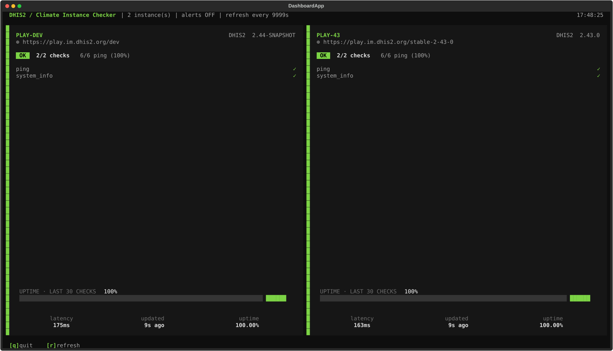
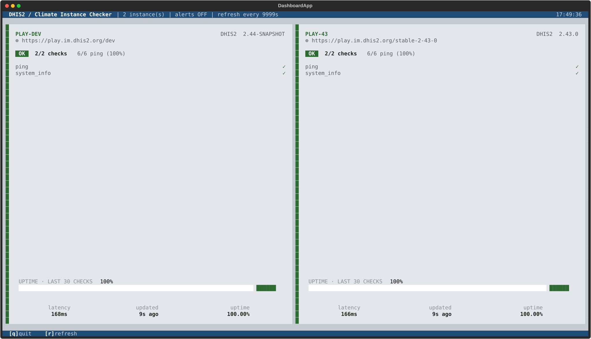
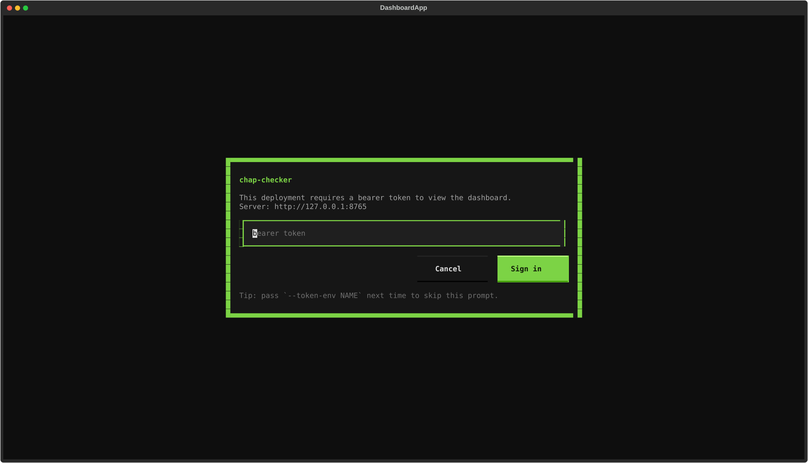
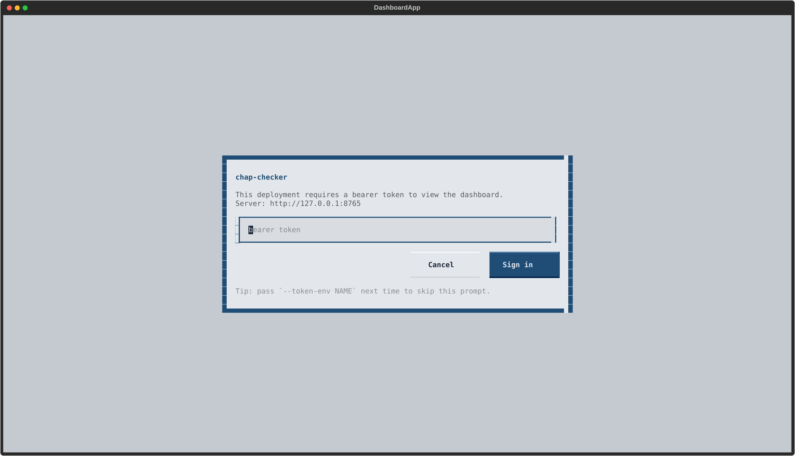

# TUI dashboard

```bash
chap-checker tui
```

A Textual-based dashboard with one tile per configured instance. Designed to
be left on a TV / second monitor so the operator sees at a glance what's up.



The `dhis2` theme (light mode, DHIS2 blue strip) for embedding in a DHIS2
ops environment:



## Layout

- **Header**: `chap-checker | N instance(s) | alerts ON|OFF | refresh every Ns ... HH:MM:SS`. The clock ticks every second.
- **Grid**: adaptive column count — 1 column for 1 instance, 2 for 2-4, 3 for 5-9, 4 for 10+.
- **Per tile**:
    - Title row: instance name in bold-green caps, DHIS2 version (extracted from the `dhis2_system_info` check) right-aligned.
    - URL row, dimmed.
    - Status pill — `OK / WARN / FAIL / ERROR` colored, plus `X/Y checks` summary and `X/Y ping (Z%)` cumulative ratio.
    - `CHECKS` section: one row per check with a colored status symbol (`✓ ! ✗ !! ·`). Names are shown with the `dhis2_` namespace stripped (`chap_` is kept so `chap_ping` stays distinct from `ping`).
    - Stats footer (docked to the bottom of the tile): latency (average duration across run checks), `updated Xs/m/h ago` (re-ticks every second), uptime (cumulative ping ratio as a percentage).
- **Visual status**: a tile's left accent stripe and background tint follow the worst current status, so a FAIL tile is unmistakable in peripheral vision.

## Keys

| Key      | Action                                                          |
| -------- | --------------------------------------------------------------- |
| `r`      | Refresh immediately (otherwise auto every `--interval` seconds).|
| `Ctrl+R` | Reload `chap-checker.toml` from disk (local mode only).         |
| `Ctrl+P` | Open the [command palette](#command-palette).                   |
| `q`      | Quit.                                                           |

There is no in-UI alert toggle — see below.

## Command palette

Textual ships a built-in command palette (`Ctrl+P`) and chap-checker
registers a small Provider that adds dashboard-specific entries, so the
same items are available in both the TUI and the [browser dashboard served by `chap-checker serve`](serve.md):

- **Refresh now** — re-run every check immediately.
- **Reload config** — re-read `chap-checker.toml` from disk and apply the
  new targets / auth / check sets in place. Tiles for surviving instances
  hot-swap; if the instance set itself changed, the next tick reconciles
  the grid.
- **Open GitHub repository** — opens `github.com/dhis2-chap/chap-checker`
  in your default browser.
- **Open documentation** — opens this docs site.

Type to filter the list. The palette also exposes Textual's built-in
system commands (toggle dark mode, take a screenshot, change theme),
which are useful for tweaking the look on a TV.

Add more entries by extending
[`ChapCheckerCommands`](https://github.com/dhis2-chap/chap-checker/blob/main/src/chap_checker/dashboard.py)
in `src/chap_checker/dashboard.py`.

## Alerts decision is at launch

```bash
chap-checker tui               # alerts OFF (the "TUI is enough" default)
chap-checker tui --alerts      # also dispatch Slack on transitions
```

When `--alerts` is set, the same per-instance `alerts = [...]` opt-in from the
TOML applies; instances without an opt-in stay silent. A runtime toggle would
invite accidental clicks during demos — keeping it explicit at launch matches
the `verify --no-alerts` semantics.

## Tweaking the refresh cadence

```bash
chap-checker tui --interval 10         # tick every 10s
chap-checker tui --interval 120        # tick every 2 minutes
```

`--interval` accepts `>= 2.0`. The clock and "updated X ago" labels still
tick every second; only the actual probes wait for the interval.

## Connect mode (cross-machine consistency)

```bash
# On the TV machine (the daemon — runs the checks, fires alerts):
chap-checker serve --host 0.0.0.0 --alerts

# On the laptop (thin client — just renders, no checks):
chap-checker tui --connect http://tv-host:8765
```

In `--connect` mode the TUI does not load a config or run any checks itself.
It polls `{URL}/api/state` each refresh tick and renders whatever the
daemon reports. If the daemon goes down, a red banner appears across the
top; the last-known tiles stay on screen and the TUI reconnects on the
next tick once the daemon comes back.

`--connect` is mutually exclusive with `--config`, `--state`, and
`--alerts` (those settings live on the remote daemon). To swap the
remote config, `POST /api/reload` on the daemon — or run
`chap-checker tui` locally on the daemon host and hit `Ctrl+R`.

### Auth prompt

If the remote daemon requires a bearer token (`[auth]` configured) and
you didn't pass `--token` / `--token-env`, the TUI pops a centred prompt
on top of the dashboard:



Type the token and press Enter (or click *Sign in*) to rebuild the
client with the bearer header and refresh. The modal picks up the
daemon's `[ui].theme` before paint, so the dhis2 deployment looks like
this:



Escape (or *Cancel*) paints the "auth rejected" banner instead and stops
re-prompting on subsequent ticks — sign in via `--token-env` and
relaunch.

## How the TUI relates to `verify` and `serve`

All three subcommands share one runner (`run_targets()`), one tile
projection (`DashboardServer`), and the same per-instance `checks`
filter and `alerts` opt-in. In local mode the TUI and `serve` each
embed their own `DashboardServer`; in `--connect` mode the TUI is a
thin client of the `serve` daemon's `DashboardServer`. Cron `verify`
is independent of both; if you want a single authoritative alert
path, stop running cron and let `chap-checker serve --alerts` fire
instead.

## Regenerating the screenshots

The dashboard image at the top is checked in at
`docs/assets/dashboard.svg`. To re-capture against a real config:

```bash
uv run python scripts/capture_dashboard.py --config chap-checker.toml \
    --output docs/assets/dashboard.svg
```

The auth-modal images are produced by a sibling script that drives a
TUI client (`DashboardApp(connect_url=URL)`) against a running daemon:

```bash
# Phosphor variant (default theme - no [ui].theme in the daemon config).
uv run python scripts/capture_token_modal.py \
    --connect http://127.0.0.1:8765 \
    --output docs/assets/tui-token-modal.svg

# dhis2 variant (daemon config has [ui] theme = "dhis2").
uv run python scripts/capture_token_modal.py \
    --connect http://127.0.0.1:8765 \
    --output docs/assets/tui-token-modal-dhis2.svg
```

See
[`scripts/capture_dashboard.py`](https://github.com/dhis2-chap/chap-checker/blob/main/scripts/capture_dashboard.py)
and
[`scripts/capture_token_modal.py`](https://github.com/dhis2-chap/chap-checker/blob/main/scripts/capture_token_modal.py)
in the repo for how the screenshots are produced (Textual `pilot` mode
+ `app.save_screenshot()`).
