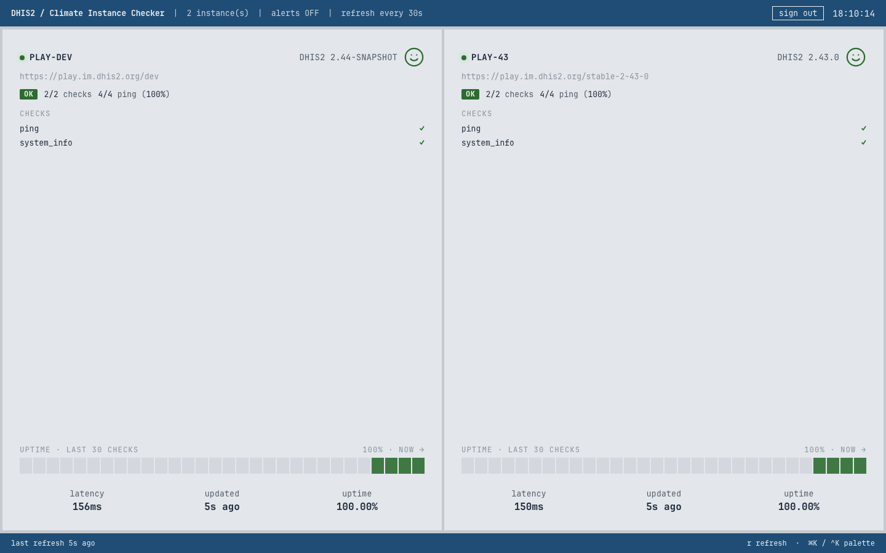

# Server (`chap-checker serve`)

```bash
chap-checker serve
# 2026-05-16 11:59:10 INFO chap_checker.serve: serving dashboard + API on http://127.0.0.1:8765
# 2026-05-16 11:59:10 INFO chap_checker.serve: config: ./chap-checker.toml
# 2026-05-16 11:59:10 INFO chap_checker.serve: interval: 30.0s; alerts: off
# INFO:     Started server process [57114]
# INFO:     Application startup complete.
# INFO:     Uvicorn running on http://127.0.0.1:8765 (Press CTRL+C to quit)
# 2026-05-16 11:59:10 INFO chap_checker.daemon: refresh: 4/4 targets ok in 384ms
# 2026-05-16 11:59:18 INFO chap_checker.serve.access: 127.0.0.1 "GET /api/state HTTP/1.1" 200 2081 0.6ms ua="curl/8.7.1"
```

Long-running daemon. Runs the check loop on its own schedule, dispatches
alerts (when `--alerts`), exposes the snapshot as JSON at `/api/state`,
and by default serves a browser dashboard at `/`. Both the [TUI in
`--connect` mode](dashboard.md#connect-mode-cross-machine-consistency)
and any browser pointed at this server consume the same snapshot.


The `dhis2` theme (light mode, DHIS2 blue strip) for embedding in a DHIS2
operations setup:



## Keys (browser)

| Key             | Action                                       |
| --------------- | -------------------------------------------- |
| `r`             | Refresh the snapshot from the server now.    |
| `f`             | Toggle browser fullscreen.                   |
| `Ctrl+K` / `⌘K` | Open the command palette.                    |
| `Esc`           | Close the palette.                           |
| `↑` / `↓`       | Move the active item in the palette.         |
| `Enter`         | Run the active palette command.              |

The command palette currently exposes:

- **Refresh now**
- **Reload config** — POST `/api/reload`; re-reads `chap-checker.toml`
  and swaps targets / cfg in place. The next `/api/state` poll picks up
  any new / removed instance tiles automatically. Also reachable via
  the **reload config** button in the header next to the clock.
- **Toggle fullscreen**
- **Density:** default / comfortable / TV / wall
- **Theme:** phosphor green / amber / high contrast / tokyo / dhis2
- **Open GitHub repository**
- **Open documentation**


The [TUI](dashboard.md#command-palette) ships the same commands via
Textual's built-in palette (`Ctrl+P`), so the same muscle memory works
in both surfaces.

## Headless mode

```bash
chap-checker serve --no-ui
```

Skips the browser dashboard — `GET /` returns 404 and the static
`web_ui/` mount is not registered. Everything under `/api/*` is
unchanged. Use this for headless deployments where only
`chap-checker tui --connect` clients or external scrapers consume the
state, or where the dashboard lives behind a separate static-file host.

## Connect from a remote TUI

```bash
# On the daemon host:
chap-checker serve --host 0.0.0.0 --alerts

# On the laptop:
chap-checker tui --connect http://daemon-host:8765
```

The TUI in `--connect` mode does not load a config or run any checks; it
polls the daemon's `/api/state` each refresh tick. Multiple TUIs +
browsers can connect simultaneously without doubling alerts or
diverging numbers — the daemon is the single source of truth.

## Logs

The daemon logs at INFO level by default:

- Startup banner (host, port, config, interval, alerts)
- Uvicorn's own startup chatter
- One line per refresh cycle from `chap_checker.daemon` (e.g.
  `refresh: 4/4 targets ok in 384ms`)
- One `chap_checker.serve.access` line per HTTP request:
  `client "METHOD path HTTP/1.1" status bytes Xms ua="..."`

Logs go to stderr. Pipe to your usual log shipper, or let `systemd`
capture them as below.

## Running under systemd

For a TV machine or small VM that should serve a dashboard 24/7, the
operator playbook is:

1. Install with `uv tool install chap-checker` (puts the binary in
   `~/.local/bin/chap-checker`) or use the absolute path returned by
   `which chap-checker`.
2. Put the config somewhere the service user can read, e.g.
   `/etc/chap-checker/chap-checker.toml`, owned by the service user
   with `chmod 0600` (the file carries credentials).
3. Drop a unit file at `/etc/systemd/system/chap-checker.service`:

   ```ini
   [Unit]
   Description=chap-checker daemon (DHIS2 health checks + browser dashboard)
   Documentation=https://dhis2-chap.github.io/chap-checker/
   After=network-online.target
   Wants=network-online.target

   [Service]
   Type=simple
   User=chap-checker
   Group=chap-checker
   WorkingDirectory=/etc/chap-checker
   # Adjust the binary path: `which chap-checker` or `which uvx`.
   ExecStart=/home/chap-checker/.local/bin/chap-checker serve \
       --config /etc/chap-checker/chap-checker.toml \
       --host 0.0.0.0 \
       --port 8765 \
       --alerts
   Restart=on-failure
   RestartSec=5

   # Logs land in the journal:
   #   journalctl -u chap-checker -f
   StandardOutput=journal
   StandardError=journal

   # Reasonable hardening defaults; loosen only what your config needs.
   NoNewPrivileges=true
   PrivateTmp=true
   ProtectSystem=strict
   ProtectHome=read-only
   ReadWritePaths=/etc/chap-checker
   ProtectKernelTunables=true
   ProtectKernelModules=true
   ProtectControlGroups=true

   [Install]
   WantedBy=multi-user.target
   ```

4. Enable and start:

   ```bash
   sudo systemctl daemon-reload
   sudo systemctl enable --now chap-checker
   sudo systemctl status chap-checker
   journalctl -u chap-checker -f
   ```

5. To pick up a config edit without a full restart:

   ```bash
   curl -X POST http://127.0.0.1:8765/api/reload
   ```

   Or `Ctrl+R` in the TUI / "Reload config" in the browser palette.

**Notes:**

- `ReadWritePaths=/etc/chap-checker` is needed because the daemon writes
  the state file next to the config (override with `--state /var/lib/...`
  if you'd rather keep `/etc` strictly read-only).
- Webhook URLs and DHIS2 credentials should live in environment files,
  not in the config when running under systemd. Add
  `EnvironmentFile=/etc/chap-checker/chap-checker.env` and reference them
  in the config as `password_env = "..."` / `webhook_url_env = "..."`.
  The env file must be `chmod 0600` and owned by the service user.

## macOS launchd

Same idea, different file format. Drop a plist at
`~/Library/LaunchAgents/io.dhis2.chap-checker.plist`:

```xml
<?xml version="1.0" encoding="UTF-8"?>
<!DOCTYPE plist PUBLIC "-//Apple//DTD PLIST 1.0//EN" "http://www.apple.com/DTDs/PropertyList-1.0.dtd">
<plist version="1.0">
<dict>
  <key>Label</key><string>io.dhis2.chap-checker</string>
  <key>ProgramArguments</key>
  <array>
    <string>/Users/you/.local/bin/chap-checker</string>
    <string>serve</string>
    <string>--config</string><string>/Users/you/.config/chap-checker.toml</string>
    <string>--host</string><string>0.0.0.0</string>
  </array>
  <key>RunAtLoad</key><true/>
  <key>KeepAlive</key><true/>
  <key>StandardOutPath</key><string>/Users/you/Library/Logs/chap-checker.log</string>
  <key>StandardErrorPath</key><string>/Users/you/Library/Logs/chap-checker.log</string>
</dict>
</plist>
```

Then `launchctl load ~/Library/LaunchAgents/io.dhis2.chap-checker.plist`.

## Flags

```bash
chap-checker serve --port 8000
chap-checker serve --host 0.0.0.0           # expose on the LAN for a TV
chap-checker serve --interval 10            # check every 10s instead of 30
chap-checker serve --alerts                 # also dispatch Slack on transitions
chap-checker serve --no-ui                  # API-only, no browser dashboard
chap-checker serve --config /etc/chap-checker.toml
```

| Flag                          | Purpose                                                                      |
| ----------------------------- | ---------------------------------------------------------------------------- |
| `--config <path>` / `-c`      | Override the default `./chap-checker.toml`.                                  |
| `--interval <seconds>`        | Server-side check refresh interval. Default 30, minimum 2.                   |
| `--alerts` / `--no-alerts`    | Dispatch Slack alerts from refresh cycles. Off by default.                   |
| `--ui` / `--no-ui`            | Serve the browser dashboard at `/`. Default on.                              |
| `--host <addr>`               | Bind address. Default `127.0.0.1`; use `0.0.0.0` for LAN exposure.           |
| `--port <port>`               | TCP port. Default `8765`.                                                    |
| `--state <path>`              | State file path (only relevant when `--alerts` is on).                       |

## Themes & density

The command palette exposes two runtime tweaks for the look:

- **Themes**: `phosphor green` (default), `amber`, `high contrast`,
  `tokyo night`, `dhis2` (light mode with the DHIS2 blue strip).
- **Density**: `default`, `comfortable`, `TV`, `wall (big numbers)`.

Defined as CSS custom-property bundles in
[`src/chap_checker/web_ui/src/app.jsx`](https://github.com/dhis2-chap/chap-checker/blob/main/src/chap_checker/web_ui/src/app.jsx)
(`THEMES`, `DENSITY`) and applied by `applyTheme()` on every tweak
change. Selections live in React state for the session; a page reload
resets to the defaults.

## Architecture

A small FastAPI app + a React/Babel-standalone SPA. No build step.

```
src/chap_checker/web_ui/
├── index.html      Loads vendor/React + vendor/Babel + src/*.jsx in order
├── vendor/         React 18.3.1 UMD + Babel 7.29.0 standalone (committed)
├── _state.js       Wiring layer (polls /api/state, maps to artifact shape)
└── src/            Designer artifact (replaced wholesale on next zip drop)
    ├── app.jsx
    ├── card.jsx
    ├── palette.jsx
    └── tweaks-panel.jsx
```

Living inside the `chap_checker` package means the assets ship with
both editable installs and built wheels (uv_build picks up everything
under `src/chap_checker/` automatically). The page loads no external
resources — React and Babel are vendored under `vendor/`, no web fonts
are fetched, and the body CSS falls back to the platform monospace
stack — so the dashboard works offline, in air-gapped kiosks, and
behind strict CSP without any third-party trust dependency.

- FastAPI runs the checks on a background `asyncio` task every
  `--interval` seconds via the shared `DashboardServer` in
  `chap_checker.daemon`.
- `GET /api/state` returns the current snapshot as JSON.
- The web UI is mounted via `StaticFiles(directory=web_ui, html=False)`
  with a dedicated `GET /` handler returning `index.html`; skip both
  with `--no-ui` for an API-only daemon.
- `_state.js` exposes `window.CK_useLiveState(pollSec)` — a React hook
  that polls `/api/state`, maps the server schema to the artifact's
  `INSTANCES_BASE` shape, and returns the latest snapshot.

The browser does *not* drive the actual probes — they happen on the
server on its own schedule. The browser is just a view.

## Authentication

Off by default for backwards compatibility, but trivial to opt in: add an `[auth]` block to your TOML and `chap-checker serve` will require an `Authorization: Bearer <token>` header on every request to `/api/state` and `/api/reload`. The browser dashboard's SPA shell stays unauthenticated so the built-in login modal can render before a token exists; static assets stay public for the same reason.

### Generate and configure a token

```bash
openssl rand -hex 32        # one-time: pick a 64-char hex token
```

In `chap-checker.toml`:

```toml
[auth]
# Inline (NOT recommended for shared configs):
# token = "REPLACE_ME"

# Recommended - export the env var via your secrets manager / systemd
# EnvironmentFile / .envrc / whatever:
token_env = "CHAP_CHECKER_TOKEN"
```

Restart the daemon. Every call to `/api/state` now needs the header:

```bash
curl http://127.0.0.1:8765/api/state                              # 401
curl -H 'Authorization: Bearer <token>' http://127.0.0.1:8765/api/state   # 200
```

### TUI clients

```bash
export CHAP_CHECKER_TOKEN=<the same token>
chap-checker tui --connect http://daemon-host:8765 --token-env CHAP_CHECKER_TOKEN
```

A wrong / missing token paints the disconnect banner with `"auth rejected by ..."` (distinct from a generic "disconnected", so you know the receiver is up but the credential is bad).

### Browser

Open the dashboard URL in a browser. First load gets a 401, the SPA renders a login modal, you paste the token, and it's stored in `localStorage` for the session. The Ctrl+K / ⌘K command palette has a **Sign out** entry that clears the stored token and reloads.

### Rotation

There's no rotation API. Update the env var (or the inline `token`) and restart `chap-checker serve`. Every existing browser session will pop the login modal on its next poll; every TUI client gets the auth-rejected banner until you update its `--token-env`.

### Threat model

Single shared token; no per-user accounts, no audit log per identity, no scope-of-access. Anyone with the token has the same view of the same instances. For stronger isolation — different views for different operators, audit trails, federated SSO — front the daemon with a reverse proxy that does its own auth (nginx + OAuth2-Proxy, Caddy + JWT, Cloudflare Access, ...). Built-in auth and a proxy aren't mutually exclusive.

### What's *not* protected

- `GET /` and the static SPA assets stay public so the login modal can render. The SPA carries no DHIS2 data; it just paints whatever `/api/state` returns.
- `GET /api/auth` is unprotected and returns `{"required": true|false}`. The SPA reads this on first load to decide whether to attach an Authorization header at all. The endpoint leaks no token material.

### Non-loopback warning

If you run `serve --host 0.0.0.0` (or any non-loopback bind) *without* an `[auth]` block configured, the daemon logs a startup WARNING — the listen socket is reachable from outside loopback and `/api/state` would be unauthenticated. The bind isn't refused (some operators are behind a reverse proxy / VPN and don't want the warning to be fatal); the nudge is just visible in the logs.

## Layout

The grid adapts to the instance count, same logic as the TUI:

| instances | columns |
| --------- | ------- |
| 1         | 1       |
| 2-4       | 2       |
| 5-9       | 3       |
| 10+       | 4       |

Tiles use `display: flex` with `margin-top: auto` on the stats row so the
bottom strip stays anchored regardless of how many check rows are above it.

## TUI vs serve

Same data, two surfaces:

|                       | TUI (`chap-checker tui`)         | Server (`chap-checker serve`)        |
| --------------------- | -------------------------------- | ------------------------------------ |
| Run on                | Terminal (SSH, tmux, locally)    | Long-running daemon (systemd, VM, TV machine) |
| Refresh model         | Drives its own probes            | Probes on a background task; clients poll JSON |
| Multi-user            | One user per session             | Many browsers + remote TUIs simultaneously |
| Best for              | Operator at a desk               | TV / kiosk / single source of truth  |
| Cross-machine clients | n/a                              | `tui --connect URL` from any host    |

The two share the same `run_targets`, state file, alert dispatch, and
per-instance config. Running both side by side is fine — they
independently track transitions against the same state file.
