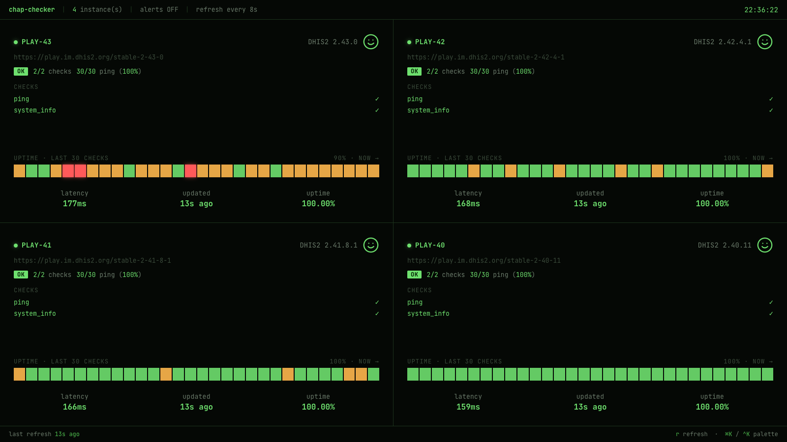
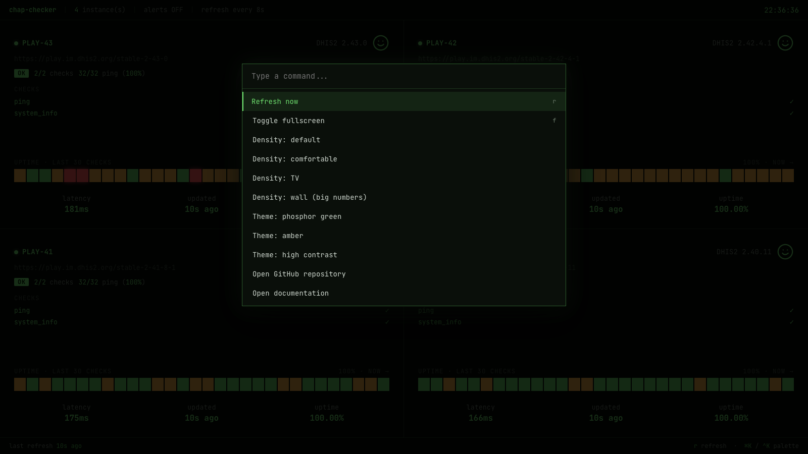

# Web dashboard

```bash
chap-checker web
# chap-checker web dashboard on http://127.0.0.1:8765
```

A React + Babel-standalone SPA served by FastAPI at `100vh` so it fills a
TV screen with no scrolling. Same status semantics as the
[Textual TUI](dashboard.md), with a CRT / phosphor look (designed by
Claude Designer) and a few theme + density tweaks. Designed for a kiosk
display: pin a browser at the URL and walk away.



## Keys

| Key             | Action                                       |
| --------------- | -------------------------------------------- |
| `r`             | Refresh the snapshot from the server now.    |
| `f`             | Toggle browser fullscreen.                   |
| `Ctrl+K` / `⌘K` | Open the command palette.                    |
| `Esc`           | Close the palette.                           |
| `↑` / `↓`       | Move the active item in the palette.         |
| `Enter`         | Run the active palette command.              |

The command palette currently exposes:

- **Refresh now**
- **Toggle fullscreen**
- **Density:** default / comfortable / TV / wall
- **Theme:** phosphor green / amber / high contrast
- **Open GitHub repository**
- **Open documentation**

Type to filter the list. Click an item or hit `Enter` to run it. New
commands are a small JSX addition in
[`web-ui/src/app.jsx`](https://github.com/dhis2-chap/chap-checker/blob/main/web-ui/src/app.jsx).



The [TUI dashboard](dashboard.md#command-palette) ships the same
chap-checker commands via Textual's built-in palette (`Ctrl+P`), so the
same muscle memory works in both surfaces.

## Themes & density

The command palette exposes two runtime tweaks for the look:

- **Themes**: `phosphor green` (default), `amber`, `high contrast`.
- **Density**: `default`, `comfortable`, `TV`, `wall (big numbers)`.

Defined as CSS custom-property bundles in
[`web-ui/src/app.jsx`](https://github.com/dhis2-chap/chap-checker/blob/main/web-ui/src/app.jsx)
(`THEMES`, `DENSITY`) and applied by `applyTheme()` on every tweak
change. Selections live in React state for the session; a page reload
resets to the defaults.

## Architecture

A small FastAPI app + a React/Babel-standalone SPA. No build step.

```
web-ui/
├── index.html      Loads vendor/React + vendor/Babel + src/*.jsx in order
├── vendor/         React 18.3.1 UMD + Babel 7.29.0 standalone (committed)
├── _state.js       Wiring layer (polls /api/state, maps to artifact shape)
└── src/            Designer artifact (replaced wholesale on next zip drop)
    ├── app.jsx
    ├── card.jsx
    ├── palette.jsx
    └── tweaks-panel.jsx
```

- FastAPI runs the checks on a background `asyncio` task every
  `--interval` seconds.
- `GET /api/state` returns the current snapshot as JSON.
- `app.mount("/", StaticFiles(directory="web-ui", html=True))` serves
  every other path; `index.html` is auto-returned for `/`.
- `_state.js` exposes `window.CK_useLiveState(pollSec)` — a React hook
  that polls `/api/state`, maps the server schema to the artifact's
  `INSTANCES_BASE` shape, and returns the latest snapshot. `app.jsx`
  consumes it via a single well-commented block (look for
  `// CK-WIRING:` in the source).

The browser does *not* drive the actual probes — they happen on the
server on its own schedule. The browser is just a view.

## Flags

```bash
chap-checker web --port 8000
chap-checker web --host 0.0.0.0           # expose on the LAN for a TV
chap-checker web --interval 10            # check every 10s instead of 30
chap-checker web --alerts                 # also dispatch Slack on transitions
chap-checker web --config /etc/chap-checker.toml
```

| Flag                          | Purpose                                                                      |
| ----------------------------- | ---------------------------------------------------------------------------- |
| `--config <path>` / `-c`      | Override the default `./chap-checker.toml`.                                  |
| `--interval <seconds>`        | Server-side check refresh interval. Default 30, minimum 2.                   |
| `--alerts` / `--no-alerts`    | Dispatch Slack alerts from refresh cycles. Off by default.                   |
| `--host <addr>`               | Bind address. Default `127.0.0.1`; use `0.0.0.0` for LAN exposure.           |
| `--port <port>`               | TCP port. Default `8765`.                                                    |
| `--state <path>`              | State file path (only relevant when `--alerts` is on).                       |

## Security

The server has **no authentication**. The credentials in your config are
never sent to the browser, but anyone who can reach the bind address can
see which DHIS2 instances are configured and their current status.

- Default `--host 127.0.0.1` keeps it on the loopback interface (most
  conservative).
- For a single TV on the LAN, `--host 0.0.0.0` is fine if the network is
  trusted.
- For anything more exposed, put it behind a reverse proxy (nginx /
  caddy) with HTTP basic auth, SSO, or VPN-gated access.

## Layout

The grid adapts to the instance count, same logic as the TUI:

| instances | columns |
| --------- | ------- |
| 1         | 1       |
| 2-4       | 2       |
| 5-9       | 3       |
| 10+       | 4       |

Tiles use `display: flex` with `margin-top: auto` on the stats row so the
bottom strip stays anchored regardless of how many check rows are above it.

## TUI vs web

Same data, two surfaces:

|                       | TUI                          | Web                                  |
| --------------------- | ---------------------------- | ------------------------------------ |
| Run on                | Terminal (SSH, tmux, locally) | Browser                              |
| Refresh model         | Drives its own probes        | Polls server JSON; server probes    |
| Multi-user            | One user per session          | Many browsers can view simultaneously |
| Best for              | Operator at a desk            | TV / kiosk                           |
| Resource use          | Light (uses your terminal)    | Server holds state, browser uses CPU |

The two surfaces share the same `run_targets`, state file, alert dispatch,
and per-instance config — running them side by side is fine.
